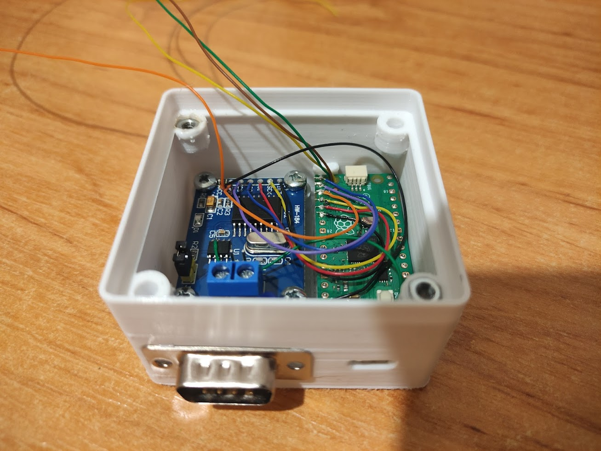
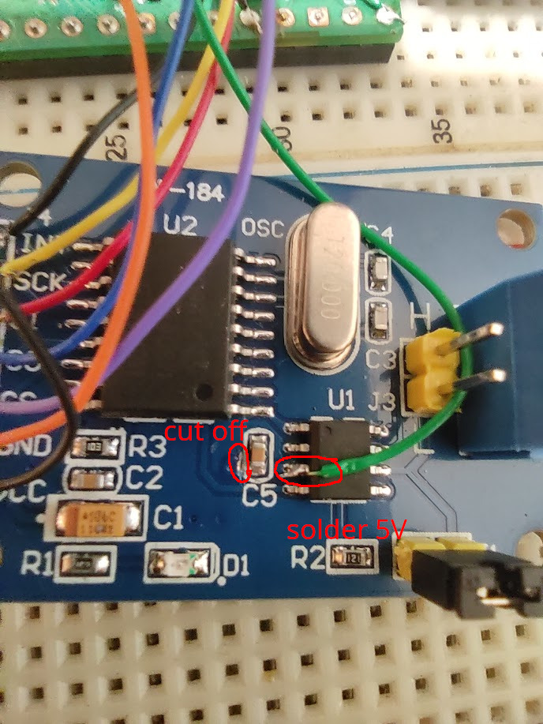

# RP2040 gs_usb compatible USB CAN

Raspberry Pico (RP2040) gs_usb compatible firmware interfacing CAN bus via cheap MCP2515 CAN controller.




## Hardware
- Raspberry Pico (RP2040)
- MCP2515 CAN module

CAN Transceiver TJA1050 on CAN module requires 5V, but Raspberry Pico is not 5V tolerant. So the path on the module should be cut off and 5V wire should be soldered directly on TJA1050 Pin 3 like on the following image:


| MCP2515 CAN module     | Raspberry Pico |
|------------------------|----------------|
| TJA1050 VCC 5V - Pin 3 | VBUS           |
| VCC                    | 3v3 OUT        |
| GND                    | GND            |
| SS                     | GP17           |
| SO                     | GP16           |
| SI                     | GP19           |
| SCK                    | GP18           |
| INT                    | GP20           |

## Build
1. install Raspberry Pico SDK
2. make sure environment variable `PICO_SDK_PATH` points to installed SDK

```sh
$ mkdir build
$ cd build
$ cmake ..
$ make -j$(nproc)
```

## Flash
You can easily flash RP2040 by pressing BOOTSEL button and copying `rp2040-can-mcp2515.uf2` to connected USB Mass storage provided by RP2040 BOOT ROM:
```
$ sudo mount /dev/sdX1 /mnt
$ sudo cp rp2040-can-mcp2515.uf2 /mnt
$ sudo sync
```

Alternative firmware can be loaded with SWD interface.

## Use
You should see `can0` interface once the device is connected to USB.
```sh
$ ip a
...
96: can0: <NOARP,ECHO> mtu 16 qdisc noop state DOWN group default qlen 10
    link/can
```

Now you can configure bitrate and bring interface up:
```sh
$ sudo ip link set can0 type can bitrate 500000
$ sudo ip link set can0 up
```

You can receive and send messages with `can-utils` package:
```sh
$ candump can0
$ cansend can0 123@DEADBEEF
```

Use following udev rule for more predictable interface name and reload with `udevadm control --reload-rules`:
```
# /etc/udev/rules.d/79-can.rules
ACTION=="add", ENV{ID_SERIAL}=="D_rp2040-can_123456", NAME="mycan"
```

Interface may be managed with `systemd-networkd`:
```
# /etc/systemd/network/can.network
[Match]
Name=mycan
# or apply same config to all CAN interfaces
#Type=can

[CAN]
BitRate=500000
```

## Tests
Both tests requires two CAN interfaces connected to single host.

### `hw_test.py`
```sh
$ RP2040_IFACE=mycan TEST_IFACE=othercan pytest
```

### Stress testing
Fully utilizes CAN bus by spamming randomly generated messages in a loop. All messages are also verified on receiver side. 
```sh
$ make tests/stress
$ ./tests/stress mycan othercan
$ ./tests/stress othercan mycan
```


